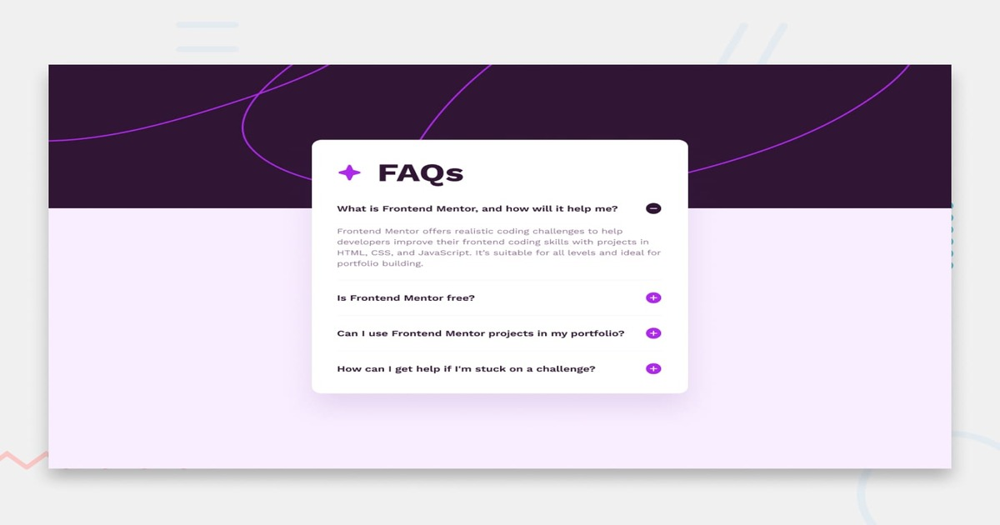

# Accordion

The **Accordion Component** project. The goal is to build a responsive accordion component page. Highly builded with accessibility and typescript, make some config options.

---

## Demo

Live demo: [DEMO](https://kamil-engineer.github.io/accordion/)

---

## Features

- 🔹 Responsive layout for desktop, tablet, and mobile devices
- 🔹 Accessible with proper ARIA attributes and keyboard navigation support
- 🔹 localStorage integration — remembers open/closed state between sessions
- 🔹 Configurable options:
  multiOpen — allow one or multiple items open
  initiallyOpenIds — predefine open items
  storageKey — custom key for state persistence
- 🔹 Smooth toggle animations (CSS transition ready)
- 🔹 Clean, semantic HTML structure
- 🔹 Reusable and easy to integrate into any static site

---

## Technologies

- **HTML5** – semantic structure and accessible markup
- **CSS3** – layout (Flexbox/Grid), transitions, responsive design
- **TypeScript** – for strong typing, safer logic, and better maintainability
- **Vanilla JavaScript (compiled)** – final output for browser compatibility
- **localStorage API** – to persist accordion state
- **ARIA & A11y** – improving accessibility for screen readers and keyboard users

## What i Learned

- How to structure an accessible accordion component from scratch
- How to use TypeScript for front-end logic and configuration objects
- How to manage component state with simple re-rendering and event delegation
- How to persist UI state using localStorage
- How to write cleaner, modular, and more reusable front-end code
- How to make UI components keyboard-friendly and ARIA-compliant

## Author

[Kamil] kamil-engineer
GitHub: https://github.com/kamil-engineer
